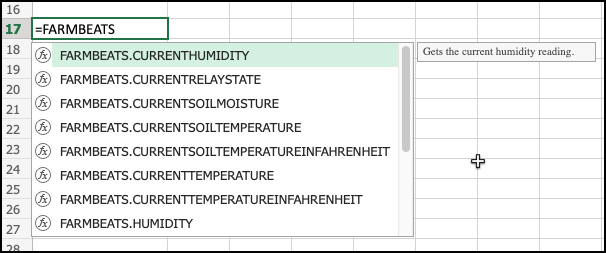

# FarmBeats for Students v-next Experimental playground

This repo contains a playground for a new version of FarmBeats for Students that works without the data streamer cable.

## FarmBeats for Students

FarmBeats for students is a combination of a hardware kit with a set of lessons designed to teach kids in grades 6-12 about digital agriculture.

* You can read more about FarmBeats for students on the [FarmBeats for students page on the Microsoft Educator Center](https://education.microsoft.com/lesson/5d991297?WT.mc_id=academic-45888-jabenn).
* You can buy the FarmBeats for students kit from the [Seeed studios FarmBeats purchase page](https://www.seeedstudio.com/Grove-Kit-with-Raspberry-Pi-4-designed-for-Microsoft-FarmBeats-for-Students-p-4872.html).

## Current limitations

FarmBeats relies on a [data streamer add-in for Excel](https://support.microsoft.com/office/what-is-data-streamer-1d52ffce-261c-4d7b-8017-89e8ee2b806f?WT.mc_id=academic-45888-jabenn) that connects to a Raspberry Pi over a serial USB cable. This has a number of limitations:

* The driver for the cable needs admin rights to install, something that not all teachers have
* The add-in only works on Excel for Windows (it is a COM add-in), not for students using Excel on the Web, or on macOS, iPads or ChromeBooks

## Attempted solution

To work round this, we've created a new version of a data streamer-like add-in. Instead of relying on a cable, this add-in can stream data from the Pi over a local network. It consists of 2 components:

* A web server hosted on a Pi written in Python
* An Excel add-in written in TypeScript

### Pi web server

The Pi web server is a Flask web app that uses the Python libraries from Seeed to communicate with the FarmBeats hardware. This web app captures sensor data every few seconds, making cached values available via a REST API. It also saves data every 60 seconds in to a SQLite database to allow you to retrieve historic data. This web app assumes the hardware is set up and configured following the instructions in the FarmBeats lesson plans.

### Excel add-in

The Excel add-in has a set of custom functions that can query the sensor data, as well as a task pane to control a relay or retrieve historic data and stream it into a sheet. It assumes a certain structure to the workbook that it is run in, and uses this to provide data to connect to the Pi.

## Getting started

### Set up the Pi

* Set up the FarmBeats hardware using the guide in the [FarmBeats for students page on the Microsoft Educator Center](https://education.microsoft.com/lesson/5d991297?WT.mc_id=academic-45888-jabenn). You just need to set up the hardware, you will use a different image on your SD card.

* Flash an SD card image using the latest Raspberry Pi OS.

  * If you are comfortable setting the WiFi and host name using the Raspberry Pi imager, install Raspberry Pi OS Lite

  * If not, install the full Raspberry Pi OS, and set the WiFi and hostname once the Pi boots up

  Each Pi will need a unique hostname. Make sure you note this hostname down.

* Once your Pi is imaged and booted up, update it:

    ```bash
    sudo apt update && sudo apt full-upgrade --yes
    ```

* Install the Grove libraries and configure the Grove hardware:

    ```bash
    curl -sL https://github.com/Seeed-Studio/grove.py/raw/master/install.sh | sudo bash -s -
    ```

* Configure the one-wire temperature (soil temperature) sensor:

    ```bash
    sudo sh -c "echo dtoverlay=w1-gpio,gpiopin=5 >> /boot/config.txt"
    ```

* Install Python3 developer tools and Git:

    ```bash
    sudo apt install python3-dev python3-pip git
    ```

* Reboot the Pi:

    ```bash
    sudo reboot
    ```

* Clone this repo:

    ```bash
    git clone https://github.com/jimbobbennett/farmbeats-vnext-experimental.git
    ```

* Navigate to the `farmbeats-server` folder:

    ```bash
    cd farmbeats-vnext-experimental/farmbeats-server
    ```

* Install the Pip packages using `sudo` - the web app needs to run under `sudo`:

    ```bash
    sudo pip3 install -r requirements.txt
    ```

* Start the server using `sudo`:

    ```bash
    sudo python3 app.py
    ```

### Set up the Excel add-in

* Clone this repo to somewhere you can run Excel via the Web:

    ```bash
    git clone https://github.com/jimbobbennett/farmbeats-vnext-experimental.git
    ```

* You will need Node 14 installed, so make sure this is installed (later versions are currently not supported by the add-in tooling)

* Navigate to the add-in folder:

    ```bash
    cd farmbeats-vnext-experimental/excel-addin
    ```

* Build and start the add-in for testing:

    ```bash
    npm run build
    npm run start:web
    ```

* Open Excel on the web, and open the `FarmBeats.xlsx` file from this repo.

* On the `Configuration` sheet, set the value in cell A2 to the hostname or IP address of the Pi.

* Install this add-in by selecting *Insert -> Office Add-ins*, then select *Manage my add-ins -> Upload My Add-in*.

* Navigate to the `manifest.xml` file in the `excel-addin` folder in this repo and upload that.

* The FarmBeats task pane will appear. You will also have access to a set of functions in the `FARMBEATS` namespace.

    

* The task pane has buttons to start streaming historic data into the `Data In` sheet. This will show the current value and the last 500 captured once a minute. You can change the number of rows and how often the data is captured in the `Configuration` sheet. THe web server captures data every 60 seconds, so you don't need to poll more than this.

* This pane also has buttons to control the relay.
